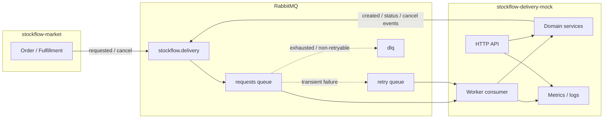

# Architecture

`stockflow-delivery-mock` is a sandbox delivery provider boundary for the
`stockflow-market` case study. It demonstrates async integration patterns that
are common in production systems: contract-first messaging, idempotent
consumers, retry/DLQ handling, failure simulation, and observability.

## StockFlow ecosystem

Part of the StockFlow ecosystem:

- [stockflow-market](https://github.com/Smiley-Alyx/stockflow-market) — marketplace backend case study
- [stockflow-erp-mock](https://github.com/Smiley-Alyx/stockflow-erp-mock) — external ERP integration mock
- [stockflow-payment-mock](https://github.com/Smiley-Alyx/stockflow-payment-mock) — external payment provider mock
- [stockflow-delivery-mock](https://github.com/Smiley-Alyx/stockflow-delivery-mock) — external delivery provider mock (this repository)

The service is intentionally compact. It runs as two processes in Docker:

| Process | Role |
| --- | --- |
| `delivery-mock` | Slim HTTP API for health, inspection, debug, metrics |
| `delivery-mock-worker` | RabbitMQ consumer for shipment requests and cancels |

Both processes share the same codebase and configuration, but they currently use
**separate in-memory repositories**. HTTP inspection reflects only shipments
created through the HTTP debug API unless a shared persistence layer is added.

## Layering

```text
app/
  Domain/Delivery/          Aggregate, enums, lifecycle, idempotency, failure modes
  Application/Handlers/     Message dispatch and orchestration
  Application/Mappers/      Contract payload mapping
  Infrastructure/
    Messaging/RabbitMq/     Consumer, publishers, retry/DLQ, idempotent events
    Persistence/            In-memory repositories (SQLite planned)
    Observability/          Prometheus registry and metrics recorder
  Http/Controllers/         Health, shipments, debug, metrics
  Bootstrap/                DI container and route wiring
```

Design choices:

- **Domain-first** — shipment rules live in `ShipmentLifecycleService` and
  `Shipment`, not in controllers or RabbitMQ adapters.
- **Thin handlers** — `ShipmentRequestedHandler` and
  `ShipmentCancelRequestedHandler` coordinate mapping, idempotency, degradation,
  and event publishing.
- **Infrastructure at the edge** — RabbitMQ details stay in
  `Infrastructure/Messaging/RabbitMq`.

## Runtime components



## Messaging pipeline

Incoming messages flow through:

1. `DeliveryRequestConsumer` — validates headers, binds log context
2. `ShipmentMessageDispatcher` — routes by routing key
3. Handler — domain operation + outbound events
4. `IdempotentDeliveryEventPublisher` — stores and replays published events

On failure:

| Failure type | Consumer action |
| --- | --- |
| Invalid payload / headers | Reject, no requeue, `delivery_invalid_messages_total` |
| Transient (`RetryableMessageException`, generic runtime errors) | Schedule retry up to `RABBITMQ_MAX_RETRY_ATTEMPTS` |
| Retry exhausted or non-retryable conflict | Move to DLQ, ack original message |
| Retry queue message ready | Requeue to main exchange via `DeliveryRetryRequeueHandler` |

## Idempotency model

Two layers protect against duplicate side effects:

1. **Domain idempotency** — `(operation, shipment_id, idempotency_key)` stored
   in `IdempotencyRecord`. Duplicate create/cancel requests skip duplicate state
   changes.
2. **Published event store** — outbound events stored by operation scope.
   Retries republish the same `message_id` and payload.

Conflicting fingerprints for the same scope raise non-retryable exceptions and
route to DLQ.

## Failure simulation

`FailureModeManager` keeps the active mode in
`var/state/failure-mode.json` so HTTP debug endpoints and the worker can share
state when they mount the same volume. In the default Docker Compose setup,
containers do not share this file unless a volume is added.

`DeliveryDegradationSimulator` applies the selected mode during message
processing and outbound publishing.

## Observability

- Structured JSON logs via `DeliveryStructuredLogger`
- `correlation_id` and `message_id` bound per message in `DeliveryLogContext`
- Prometheus metrics at `GET /metrics` (disable with
  `DELIVERY_MOCK_METRICS_ENABLED=false`)

## Trade-offs

| Decision | Benefit | Cost |
| --- | --- | --- |
| In-memory persistence | Fast local demos, zero DB setup | HTTP and worker see different state; data lost on restart |
| File-backed failure mode | Cross-process debug without DB | Not shared across Docker containers by default |
| In-process Prometheus registry | Simple metrics endpoint for demos | Not suitable for multi-instance scraping without push/exporter |
| Slim PHP instead of full framework | Small surface area, easy to read in a portfolio | Fewer batteries (no ORM migrations, queue dashboard, etc.) |
| Idempotent event replay | Safe marketplace reconciliation on retries | Requires published-event storage and conflict handling |
| Separate retry queue + requeue handler | Visible retry delay and operator-friendly flow | More moving parts than delayed requeue via TTL only |

## Related docs

- [Delivery flow](delivery-flow.md) — sequence diagrams and status model
- [Failure modes](failure-modes.md) — simulated provider failures and retry/DLQ
- [Demo commands](demo.md) — local walkthrough
- [Messaging contracts](../contracts/README.md) — AsyncAPI, schemas, headers
