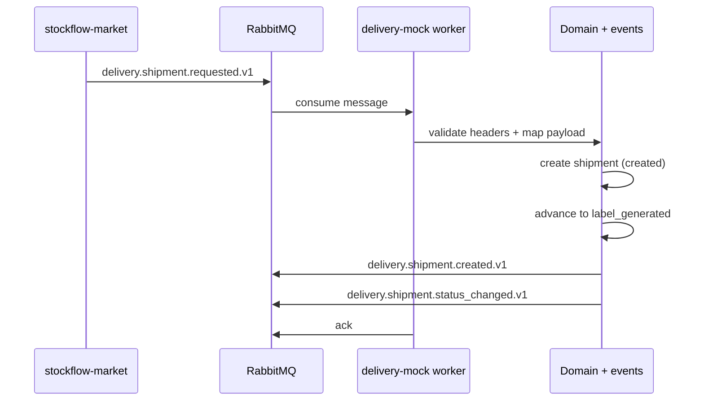
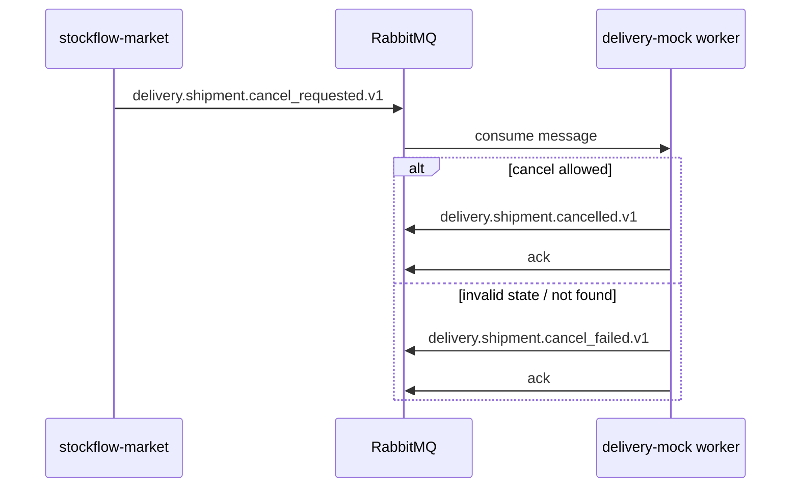
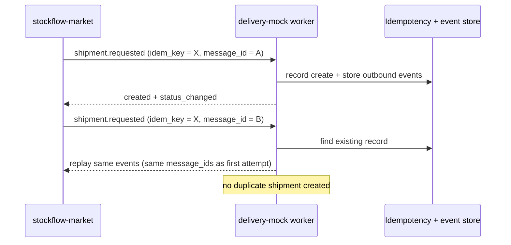
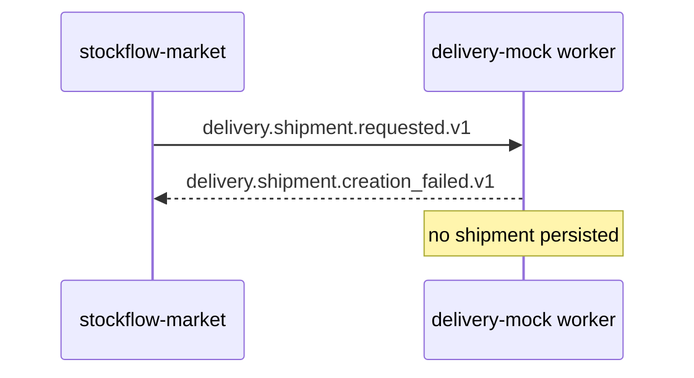
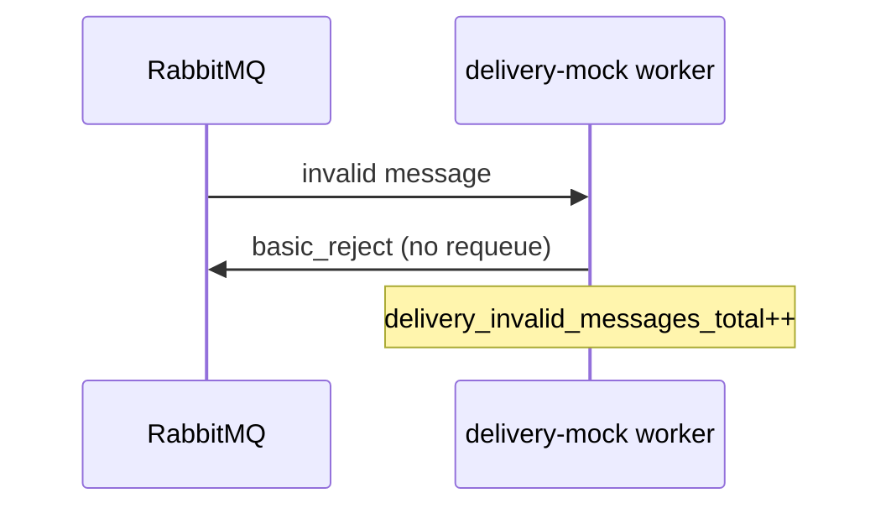
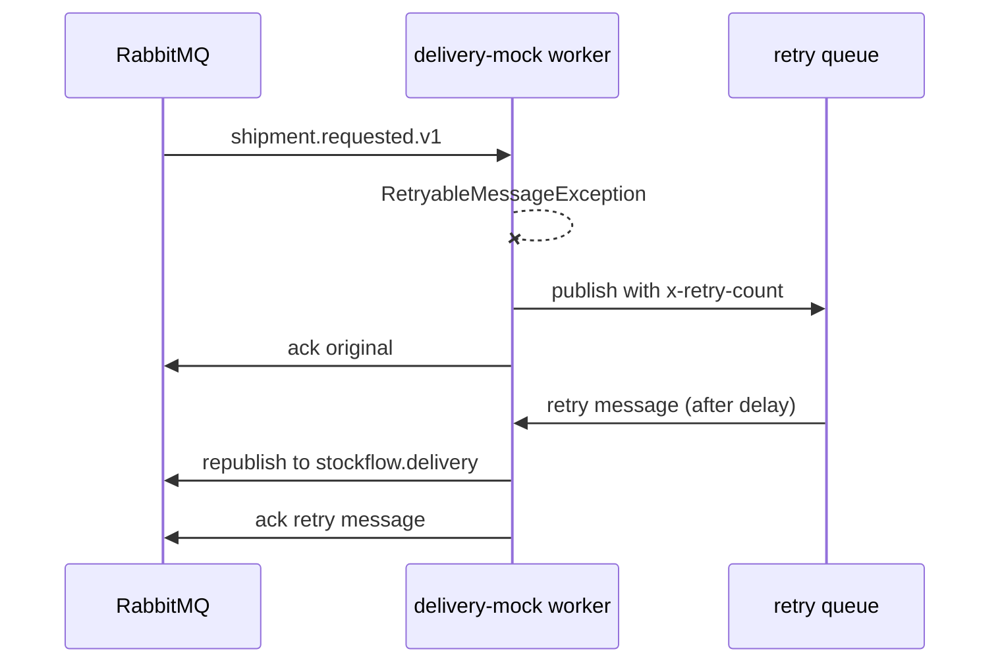

# Delivery flow

This document describes the shipment lifecycle as implemented by
`stockflow-delivery-mock`, including happy path, cancellation, idempotent
retries, and status progression.

Contract details live in [`contracts/README.md`](../contracts/README.md).

Part of the StockFlow ecosystem:
[stockflow-market](https://github.com/Smiley-Alyx/stockflow-market),
[stockflow-erp-mock](https://github.com/Smiley-Alyx/stockflow-erp-mock),
[stockflow-payment-mock](https://github.com/Smiley-Alyx/stockflow-payment-mock),
[stockflow-delivery-mock](https://github.com/Smiley-Alyx/stockflow-delivery-mock).

## Shipment statuses

```text
created
  -> label_generated -> picked_up -> in_transit -> out_for_delivery -> delivered

delivery_failed -> return_requested -> return_in_transit -> returned

created | label_generated | picked_up  -> cancelled   (before in_transit)
```

Terminal statuses: `delivered`, `returned`, `cancelled`.

After a successful create request, the worker automatically advances the
shipment from `created` to `label_generated` and publishes a
`delivery.shipment.status_changed.v1` event.

Further transitions are driven by:

- HTTP debug endpoints (`advance-status`, `mark-delivered`, `mark-failed`, `cancel`)
- Future marketplace-driven events (not implemented in this mock)

## Happy path — create shipment



Expected outbound sequence:

1. `delivery.shipment.created.v1`
2. `delivery.shipment.status_changed.v1` with `current_status = label_generated`

Header propagation rules:

- Outgoing events copy `correlation_id` from the request
- `causation_id` is set to the incoming `message_id`
- Each published event gets a new unique `message_id`

## Cancel flow

Cancellation is allowed while the shipment is in `created`, `label_generated`,
or `picked_up`. Attempts after `in_transit` produce
`delivery.shipment.cancel_failed.v1`.



## Idempotent retry

When the marketplace retries with the same `idempotency_key` for the same
shipment and operation:



Domain idempotency prevents duplicate shipments. The published-event store
ensures outbound replays use the original event identities.

## Creation failure

When the provider rejects creation (validation failure mode or business rule):



Common `failure_code` values: `address_invalid`, `creation_failed`.

## Invalid message

Malformed payloads or missing contract headers are rejected without retry:



## Transient failure and retry

Simulated provider outages (`provider_unavailable`, `timeout`, publish failure)
raise `RetryableMessageException`:



After requeue, the message is processed again on the main requests queue. If
retries are exhausted, the message moves to DLQ.

## HTTP inspection flow

The HTTP API mirrors domain operations for local debugging:

| Action | Endpoint | Effect |
| --- | --- | --- |
| List | `GET /shipments` | All shipments in HTTP process memory |
| Detail | `GET /shipments/{id}` | Shipment + status history |
| Advance | `POST /shipments/{id}/advance-status` | Next default happy-path status |
| Deliver | `POST /shipments/{id}/mark-delivered` | Force `delivered` |
| Fail | `POST /shipments/{id}/mark-failed` | Force `delivery_failed` |
| Cancel | `POST /shipments/{id}/cancel` | Cancel when allowed |

Important: shipments created by the RabbitMQ worker are **not** visible on HTTP
until shared persistence is introduced. For messaging demos, rely on published
events and metrics; for HTTP demos, create shipments via debug endpoints or
seed through tests.

## Metrics emitted per flow

| Flow | Example metrics |
| --- | --- |
| Successful create | `delivery_requests_total{outcome="created"}`, `delivery_events_published_total` |
| Idempotent replay | `delivery_idempotent_replays_total` |
| Creation failed | `delivery_requests_total{outcome="creation_failed"}` |
| Retry scheduled | `delivery_request_retries_total` |
| Retry requeued | `delivery_request_retry_requeues_total` |
| DLQ | `delivery_request_dlq_total` |

See [`demo.md`](demo.md) for commands to observe these locally.
