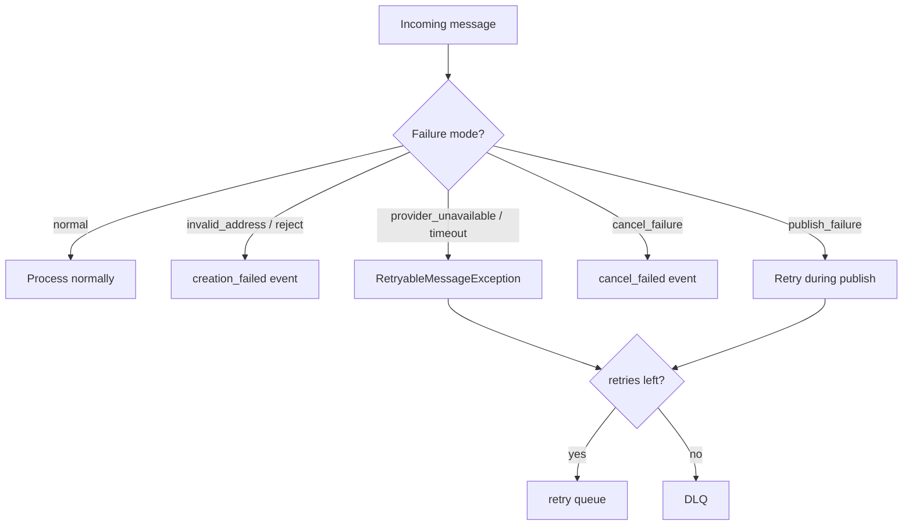

# Failure modes

The delivery mock can simulate provider degradation for demos and integration
tests. Modes are switched at runtime through debug HTTP endpoints and stored in
`var/state/failure-mode.json`.

Part of the StockFlow ecosystem:
[stockflow-market](https://github.com/Smiley-Alyx/stockflow-market),
[stockflow-erp-mock](https://github.com/Smiley-Alyx/stockflow-erp-mock),
[stockflow-payment-mock](https://github.com/Smiley-Alyx/stockflow-payment-mock),
[stockflow-delivery-mock](https://github.com/Smiley-Alyx/stockflow-delivery-mock).

Enable debug endpoints:

```bash
export DELIVERY_MOCK_DEBUG_ENABLED=true
```

## Available modes

| Mode | Value | Behavior |
| --- | --- | --- |
| Normal | `normal` | Standard processing |
| Always reject creation | `always_reject_creation` | Publishes `creation_failed` (`creation_failed`) |
| Random reject creation | `random_reject_creation` | ~50% creation failures |
| Invalid address | `invalid_address` | Publishes `creation_failed` (`address_invalid`) |
| Processing delay | `processing_delay` | Adds configured delay before processing |
| Provider unavailable | `provider_unavailable` | Throws retryable error → retry queue |
| Timeout | `timeout` | Throws retryable error → retry queue |
| Cancel failure | `cancel_failure` | Publishes `cancel_failed`, shipment unchanged |
| Duplicate response | `duplicate_response` | Publishes outbound event twice (same payload) |
| Publish failure | `publish_failure` | Throws retryable error during outbound publish |

Set a mode:

```bash
curl -s -X POST http://localhost:8082/debug/failure-mode \
  -H 'Content-Type: application/json' \
  -d '{"mode":"provider_unavailable"}'
```

Reset to normal:

```bash
curl -s -X POST http://localhost:8082/debug/reset
```

## Failure categories

### Business failures (ack, no retry)

These complete message processing and publish a negative outcome event:

| Scenario | Outbound event | Notes |
| --- | --- | --- |
| Invalid address mode | `creation_failed.v1` | `failure_code = address_invalid` |
| Always / random reject | `creation_failed.v1` | `failure_code = creation_failed` |
| Cancel not allowed | `cancel_failed.v1` | Shipment stays in current status |
| Cancel failure mode | `cancel_failed.v1` | Simulated provider rejection |

### Invalid messages (reject, no retry)

| Scenario | Consumer action |
| --- | --- |
| Missing required payload fields | `basic_reject`, metric `delivery_invalid_messages_total` |
| Invalid `delivery_address` / headers | Same |

Invalid messages never enter the retry queue.

### Transient failures (retry → DLQ)

| Scenario | First attempts | After max retries |
| --- | --- | --- |
| `provider_unavailable` | Retry queue with incremented `x-retry-count` | DLQ |
| `timeout` | Same | DLQ |
| `publish_failure` | Same | DLQ |
| Unexpected runtime errors | Same | DLQ |

Default retry settings:

| Variable | Default |
| --- | --- |
| `RABBITMQ_MAX_RETRY_ATTEMPTS` | `3` |
| `RABBITMQ_RETRY_DELAY_MS` | `5000` |

Retry flow:

1. Failure handler publishes to `stockflow.delivery.requests.retry`
2. Retry consumer waits until `x-retry-after` (if configured)
3. `DeliveryRetryRequeueHandler` republishes to exchange with original routing key
4. Main consumer processes again

### Non-retryable processing conflicts (DLQ)

These skip retry and go directly to DLQ:

- `PublishedEventConflictException` — same operation scope, different payload fingerprint
- `IdempotencyConflictException` — same idempotency key, different request fingerprint

These indicate data inconsistency that automatic retries cannot fix.

## Mode interaction matrix



## Observability during failures

Prometheus gauge `delivery_failure_mode_active{mode="..."}` shows which mode is
active (value `1` for current mode, `0` for others).

Structured logs include:

- `delivery.request.failed` — processing exception with retry count
- `delivery.request.retry_scheduled` — message sent to retry queue
- `delivery.request.retry_requeued` — message returned to main exchange
- `delivery.request.dlq` — message moved to dead-letter queue
- `delivery.request.invalid` — rejected invalid message

## Demo scenarios

| Goal | Mode | Expected result |
| --- | --- | --- |
| Show address validation failure | `invalid_address` | `creation_failed` with `address_invalid` |
| Show retry then recovery | `provider_unavailable`, then `normal` | Retries in metrics, then successful create |
| Show cancel rejection | `cancel_failure` | `cancel_failed`, shipment still active |
| Show DLQ exhaustion | `provider_unavailable` with low max retries | `delivery_request_dlq_total` increases |
| Show idempotent duplicate | `normal`, send same message twice | Same outbound `message_id`s, one shipment |

Step-by-step commands: [`demo.md`](demo.md).

## Trade-offs in failure simulation

- **File-backed state** is simple for local use but requires a shared volume for
  HTTP + worker in Docker.
- **Retryable vs business failure** separation matches production boundaries:
  retry infrastructure errors, do not retry contract violations.
- **Duplicate response mode** helps test marketplace deduplication without
  corrupting domain state.
